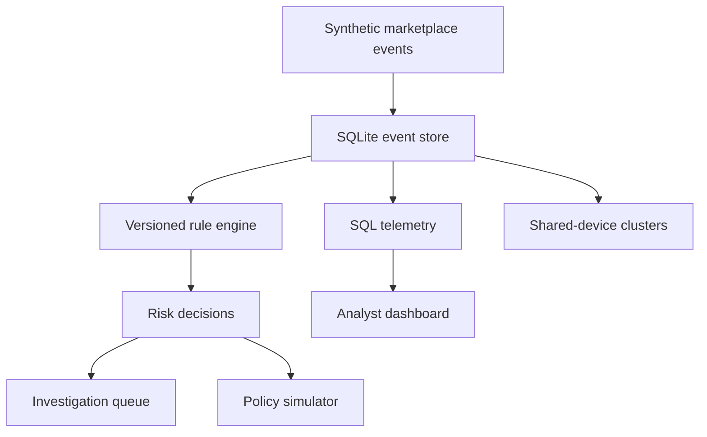

# ShopGuard — TikTok Shop Risk Intelligence Portfolio Project

An end-to-end marketplace fraud monitoring, investigation, and policy-simulation platform designed around the responsibilities of a TikTok Shop Risk Control analyst. This is an **independent portfolio project** built with synthetic data and is not affiliated with or endorsed by TikTok or ByteDance.

## What it demonstrates

- SQL-driven marketplace monitoring and quantitative analysis
- Transparent, versioned anti-fraud controls
- Detection of payment abuse, promotion abuse, account takeover, refund abuse, and seller collusion
- Shared-device fraud-ring discovery
- Prioritized investigation case queues
- Policy simulation that balances fraud capture against false positives
- Reproducible synthetic data, REST APIs, tests, and dashboards

## Architecture



## Quick start

```bash
python -m venv .venv
source .venv/bin/activate  # Windows: .venv\\Scripts\\activate
pip install -r requirements.txt
uvicorn app.main:app --reload
```

In a second terminal:

```bash
streamlit run dashboard.py
```

- API documentation: http://localhost:8000/docs
- Analyst dashboard: http://localhost:8501

The database is initialized automatically with 500 deterministic synthetic orders.

## API endpoints

| Endpoint | Purpose |
|---|---|
| `POST /score` | Explainable real-time order risk score |
| `GET /analytics/overview` | Core fraud and enforcement KPIs |
| `GET /analytics/trends` | Daily marketplace telemetry |
| `GET /analytics/rules` | Rule-hit monitoring |
| `GET /cases` | Prioritized investigations |
| `GET /rings` | Coordinated shared-device candidates |
| `GET /policy/simulate` | Threshold impact analysis |

## Example risk evaluation

```bash
curl -X POST http://localhost:8000/score -H "Content-Type: application/json" -d '{
  "amount": 799,
  "account_age_days": 2,
  "device_account_count": 8,
  "orders_last_hour": 6,
  "promo_uses_24h": 4,
  "home_state": "CA",
  "transaction_state": "NY",
  "distance_miles": 2445,
  "seller_refund_rate": 0.38,
  "failed_payments": 4
}'
```

## Governance choices

- Every decision contains specific rule evidence.
- Synthetic fraud labels are never represented as production outcomes.
- Policies can be simulated before enforcement.
- The dashboard exposes false positives alongside fraud capture.
- The system is a decision-support prototype, not an autonomous production blocker.

## Testing

```bash
pytest -q
```

## Roadmap

- PostgreSQL and dbt warehouse models
- Buyer–seller–device graph visualization with NetworkX
- Analyst case disposition and enforcement audit trail
- Model drift and rule precision monitoring
- Market-level access controls and policy version history

