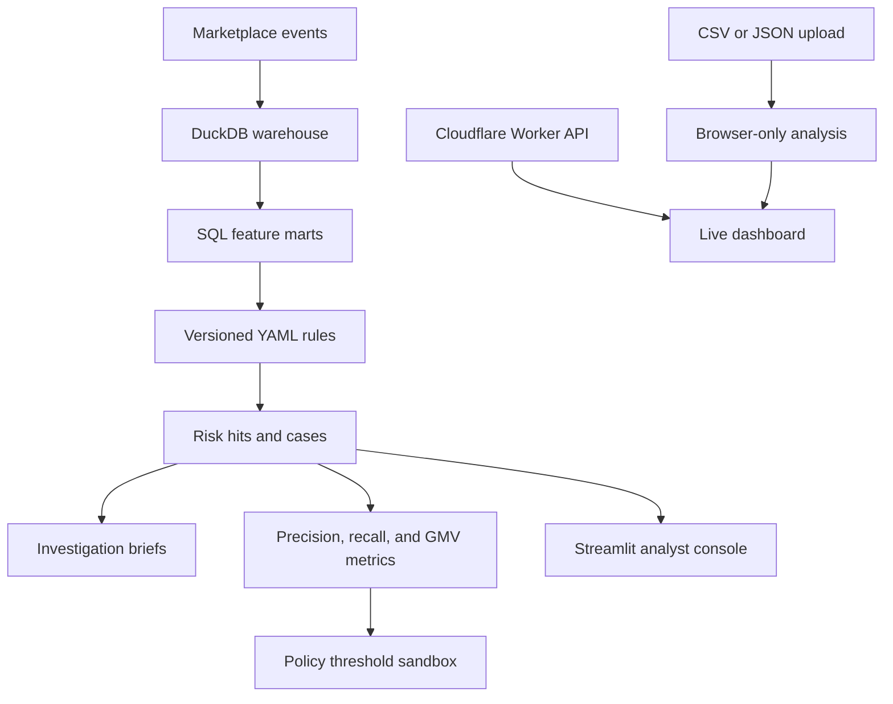

# 🛡️ Shop Risk Intelligence

<p align="center">
  <strong>Marketplace fraud monitoring, investigation, enforcement, and policy simulation for a TikTok Shop–style ecosystem.</strong>
</p>

<p align="center">
  <a href="https://tiktok-shop-risk-intelligence.madanmohanlearning.workers.dev/"></a>
  <a href="https://www.python.org/"></a>
  <a href="https://duckdb.org/"></a>
  <a href="https://developers.cloudflare.com/workers/"></a>
</p>

<p align="center">
  <strong>🌐 <a href="https://tiktok-shop-risk-intelligence.madanmohanlearning.workers.dev/">Open the live risk-intelligence dashboard</a></strong>
</p>

---

## Evaluate the prototype with its data provenance intact

This repository demonstrates marketplace risk analysis with synthetic data and configurable rules. It is not an official TikTok product and does not establish access to real seller, order or enforcement records.

Use the [CLI](src/shop_risk/cli.py) for the Python pipeline and [Worker](worker/index.js) for the browser dashboard. Review the rule definitions in [configs](configs/) before interpreting a flag. Rule thresholds are hypotheses to validate against labeled, permitted data; a dashboard flag is not a finding of fraud or a platform enforcement decision.

Preserve the input source, rule version and run configuration with exported results. For interface changes run `npm run check`; use the Python tests for pipeline behavior as described below.

## Overview

Shop Risk Intelligence is an end-to-end portfolio project designed around the work of an e-commerce Risk Control and Anti-Fraud team. It turns marketplace activity into SQL features, transparent rule hits, investigation cases, enforcement recommendations, monitoring metrics, and policy-impact simulations.

The project includes two complementary applications:

1. **Cloudflare application:** a globally deployed analyst dashboard and Worker API for risk telemetry, case prioritization, rules, scoring, policy simulation, and private CSV/JSON analysis.
2. **Python analytics platform:** a reproducible DuckDB pipeline that generates synthetic marketplace activity, materializes buyer/seller/creator/order features, runs versioned YAML rules, evaluates detection quality, and produces investigation briefs.

All included data is synthetic. This project is independent and is not affiliated with or endorsed by TikTok or ByteDance.

## Live application

**Deployment:** [tiktok-shop-risk-intelligence.madanmohanlearning.workers.dev](https://tiktok-shop-risk-intelligence.madanmohanlearning.workers.dev/)

The deployed dashboard provides:

- Marketplace order, GMV, rule-hit, open-case, and GMV-at-risk metrics
- A risk-ranked investigation queue
- Fraud typology, market, severity, and recommended-action context
- A policy threshold sandbox showing enforcement volume and value reviewed
- CSV and JSON upload for analyzing private datasets locally in the browser
- A downloadable input template
- Cloudflare Worker APIs for dashboard data and custom scoring

## Analyze your own data

Select **Upload data** in the live dashboard and choose a CSV or JSON file.

Privacy characteristics:

- Analysis executes entirely inside the browser.
- Uploaded data is not posted to the Worker.
- Files are not persisted, logged, or shared with an external service.
- Displayed values are escaped before being added to the dashboard.
- Uploads are limited to 5 MB and 10,000 rows.

Supported JSON formats are a top-level array or an object containing `records`, `orders`, `cases`, or `data`.

Common supported fields:

```text
order_id, entity_id, buyer_id, seller_id, market,
amount, gmv, risk_score, fraud_type, typology,
status, action, refund_rate_28d, refunds_28d,
shared_device_peers, new_device, distance_miles,
velocity_1h, auth_fail_1h, avs_mismatch
```

When `risk_score` is unavailable, the browser applies transparent rules to the available behavioral signals. Precision and recall are not fabricated for uploaded data without ground-truth labels.

## Fraud coverage

| Fraud type | Example signals | Default response |
|---|---|---|
| Refund abuse | Refund frequency, keep-item claims, time after delivery | Refund hold |
| Brushing and fake GMV | Thin buyers, shared devices, instant reviews | Delist and GMV clawback |
| Promotion abuse | New accounts, coupon stacking, device reuse | Coupon restriction |
| Review manipulation | Rating bursts, templated text, unverified reviews | Review takedown |
| Seller collusion | Shared devices, payouts, warehouses, network components | Network hold |
| Account takeover | New device, new destination, geographic hop, velocity | Step-up authentication |
| Payment fraud | Authorization failures, AVS/BIN mismatch | Payment block |
| Affiliate fraud | Self-purchase loops, click concentration | Commission clawback |
| Livestream fraud | Inorganic traffic spikes and brushing overlap | Ranking suppression |

## Architecture



## Job-description alignment

| Risk Control responsibility | Project implementation |
|---|---|
| Large-scale quantitative analysis | DuckDB warehouse, SQL feature marts, seeded marketplace simulator |
| Investigate fraudulent activity | Prioritized case packets with evidence and related entity features |
| Develop anti-fraud rules | Versioned `configs/rules.yaml` rule pack with rationales and actions |
| Build pipelines and monitoring | Buyer, seller, creator, order, and KPI SQL pipelines |
| Capture emerging risks | Nine marketplace fraud typologies and configurable market policies |
| Design enforcement workflows | Severity-based enforcement ladder, SLAs, UX costs, and guardrails |
| Balance fraud prevention and UX | Policy threshold sandbox and false-positive-aware evaluation |
| Communicate with stakeholders | Deterministic analyst briefs, RCA, SOP, and investigation playbook |

## Rule design

Rules are SQL-driven and explainable rather than hidden behind a single black-box prediction. Each rule specifies:

- Rule identifier and fraud typology
- Entity type: buyer, seller, creator, order, or network
- Severity and recommended action
- Risk weight and rationale
- SQL selection logic
- Evidence returned to investigators

Examples include `REFUND_SERIAL_28D`, `BRUSH_NEW_BUYER_REVIEW`, `ATO_GEO_DEVICE_VELOCITY`, `NETWORK_SHARED_DEVICE`, and `AFFILIATE_SELF_LOOP`.

## Run the Python analytics platform

```bash
git clone https://github.com/MadanMohan0537/TikTok-Shop-Risk-Intelligence.git
cd TikTok-Shop-Risk-Intelligence

python -m venv .venv
source .venv/bin/activate  # Windows: .venv\Scripts\activate
pip install -e ".[dev]"

shop-risk run --demo
shop-risk dashboard
```

Useful commands:

```bash
shop-risk generate --seed 42
shop-risk features
shop-risk score
shop-risk evaluate
shop-risk policy
shop-risk investigate --top 5
shop-risk investigate --prompt
pytest -q
```

## Run the Cloudflare application locally

```bash
npm install
npm run check
npm run dev
```

Open the local URL printed by Wrangler.

Worker endpoints:

| Endpoint | Purpose |
|---|---|
| `GET /health` | Runtime health check |
| `GET /api/overview` | Marketplace risk KPIs |
| `GET /api/cases` | Prioritized investigation queue |
| `GET /api/rules` | Cloudflare rule catalog |
| `GET /api/policy?threshold=70` | Enforcement-threshold simulation |
| `POST /api/score` | Explainable order risk evaluation |

## Deploy to Cloudflare

Cloudflare Workers build configuration:

```text
Production branch: main
Build command: npm install
Deploy command: npm run deploy
Root directory: leave blank
```

Do not enter `/` in the root-directory field.

Manual deployment:

```bash
npm install
npm run deploy
```

## Repository structure

```text
configs/          Fraud typologies, markets, rules, enforcement ladder
sql/              Buyer, seller, creator, order, and KPI feature pipelines
src/shop_risk/    Simulation, warehouse, rule engine, monitoring, CLI
dashboards/       Local Streamlit analyst console
docs/             SOP, investigation playbook, metrics, worked RCA
tests/            Seeded unit and integration tests
worker/           Cloudflare Worker API
public/           Cloudflare-hosted analyst dashboard
```

## Evaluation and responsible use

- Labels exist only in the synthetic evaluation dataset.
- Reported metrics are portfolio demonstration results, not production performance.
- Every typology includes a user-experience guardrail.
- The project prefers step-up authentication or review when a hard block would create excessive legitimate-user friction.
- Uploaded datasets should exclude unnecessary personal or sensitive information.
- The application is a decision-support prototype and must not be used to attack or target a real marketplace.

## Testing

```bash
pytest -q
npm run check
```

GitHub Actions runs the Python test suite on every push and pull request.

## Disclaimer

This project uses a fictional marketplace and synthetic abuse patterns inspired by commonly discussed e-commerce risks. It does not use TikTok internal data and is not an official TikTok or ByteDance product.
