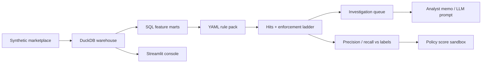

# Shop Risk Intelligence

Marketplace fraud detection, investigation, and policy simulation for a **TikTok Shop–style** e-commerce ecosystem.

Independent portfolio project for the **Anti-Fraud Analyst, TikTok Shop USDS (GNE / Risk Control)** role. Built with **synthetic data**. Not affiliated with, or endorsed by, TikTok or ByteDance.

The USDS Risk Control brief is to fight fraud with insight generation, scaled enforcement, automation, and prevention — while the business still complies with US rules and does not torch honest buyers, sellers, or creators. This repo is that loop in miniature:

1. Query a warehouse (DuckDB, MySQL-shaped SQL).
2. Materialize entity features.
3. Score versioned YAML rules.
4. Open investigation packets with UX guardrails.
5. Measure precision / recall / GMV on a labeled holdout.
6. Sandbox a stricter threshold before you ship it to ops.

## What it maps to on the job

| Job responsibility | In this repo |
| --- | --- |
| Query databases and pull investigation insights | `sql/*.sql` feature marts + `shop-risk investigate` |
| RCA on emerging trends | `docs/rca_refund_abuse.md`, LLM RCA prompt in `investigation/prompts.py` |
| Maintain enforcement rules and policy | `configs/rules.yaml`, `configs/enforcement.yaml`, `configs/fraud_typology.yaml` |
| Abnormal behavior → rules / models / strategies | Rule engine + injected cohorts in `data/simulate.py` |
| Track progress with key metrics | `shop-risk evaluate`, Streamlit dashboard |
| SOPs for scaled manual review | `docs/sop_manual_review.md` |
| LLM prompt / agent work (preferred) | `src/shop_risk/investigation/prompts.py` + offline briefings |
| Python (preferred) | CLI, simulator, evaluator, tests |

Fraud types covered: **refund abuse, brushing / fake GMV, promo stacking, review manipulation, seller collusion, account takeover, payment fraud, affiliate self-loops, livestream ranking fraud**.

## Architecture



Markets in `configs/markets.yaml` carry different risk priors (US/UK lean user-experience; ID/TH lean scaled prevention) — the same tension GNE has between trust and growth.

## Quick start

```bash
python -m venv .venv
source .venv/bin/activate
pip install -e ".[dev]"

shop-risk run --demo
shop-risk dashboard
```

`run --demo` generates a smaller labeled marketplace, builds features, scores rules, prints holdout metrics, a policy curve, and the top investigation briefs.

Useful commands:

```bash
shop-risk generate --seed 42          # full-size synthetic window
shop-risk features                    # rebuild buyer/seller/creator/order marts
shop-risk score                       # execute configs/rules.yaml
shop-risk evaluate                    # precision, recall, GMV on hit orders
shop-risk policy                      # what if we only enforce score >= 0.7?
shop-risk investigate --top 5
shop-risk investigate --prompt        # LLM-ready case brief
pytest -q
```

## Rule pack

Rules are SQL over the feature mart, not a black-box score. Each row in `configs/rules.yaml` has a typology, severity, enforcement action, weight, rationale, and a query that returns `entity_id`, `score`, and `evidence`.

Examples:

- `REFUND_SERIAL_28D` — repeat keep-item refunds inside 36 hours of delivery
- `BRUSH_NEW_BUYER_REVIEW` — thin buyers + instant five-star reviews
- `ATO_GEO_DEVICE_VELOCITY` — trusted account, new device, far ship-to, compressed velocity
- `NETWORK_SHARED_DEVICE` — mule-device / shared-payout shop components
- `AFFILIATE_SELF_LOOP` — creator-device self-purchase + click concentration

Enforcement is a ladder (`step_up_auth` → holds → blocks → network freeze) with an **UX cost** and SLA so the first-time legitimate return does not get the same treatment as a mule farm.

## Investigation workflow

`shop-risk investigate` collapses hits into a case packet: entity, market, evidence, related 28d features, recommended action, and the typology's UX guardrail. It writes a deterministic analyst memo (no API key required) and can emit the **same slots as an LLM prompt** so you can drop it into an agent.

That is the preferred qualification — prompt contracts for case briefs, RCA, policy one-pagers, and ops SOPs live in `src/shop_risk/investigation/prompts.py`.

## Metrics

Synthetic labels are injected with the fraud cohorts. `shop-risk evaluate` reports precision / recall / F1 overall and by typology. Treat them as a **holdout for the rule pack**, not as production model performance.

The Streamlit console also shows market GMV, refund rate, rule-hit mix, the investigation queue, and a score-threshold sandbox (precision vs recall vs volume).

## Repo layout

```
configs/          typology, markets, rules, enforcement ladder
sql/              DuckDB feature pipelines (buyer, seller, creator, order, KPIs)
src/shop_risk/    simulator, warehouse, rules, investigation, CLI
dashboards/       Streamlit analyst console
docs/             SOP, playbook, worked RCA
tests/            pytest against a seeded demo warehouse
```

## Design choices

- **SQL is the source of truth** for features and rules, matching how an analyst actually ships detection.
- **False positives are first-class.** Every typology has a UX guardrail; US/UK configs bias toward experience.
- **Labels never leave the `labels` table.** The dashboard and README do not pretend synthetic flags are production outcomes.
- **No live LLM call in CI.** Prompts are versioned; briefs are deterministic so the pipeline stays reproducible.
- **USDS-shaped compliance note:** ATO and stolen-instrument paths prefer step-up / payment block over silent account seizure.

## Testing

```bash
pytest -q
```

CI runs the same suite on 3.11 (`.github/workflows/ci.yml`).

## Disclaimer

This project uses a fictional marketplace and synthetic abuse patterns inspired by publicly discussed e-commerce fraud (brushing, friendly fraud, ATO, affiliate self-dealing). It is not a TikTok internal system, does not use TikTok data, and is not suitable for attacking real platforms.


## Cloudflare deployment

The repository includes a Cloudflare-native dashboard and Worker API alongside the full Python analytics project:

- `public/index.html` — deployable analyst dashboard
- `worker/index.js` — risk telemetry, cases, scoring, rules, and policy APIs
- `wrangler.jsonc` — Worker and static-assets configuration
- `package.json` — deterministic Cloudflare build commands

Cloudflare Workers build settings:

```text
Build command: npm install
Deploy command: npm run deploy
Root directory: leave blank
Production branch: main
```

Do not set the root directory to `/`. The Python/Streamlit console remains available locally, while the Cloudflare deployment uses the edge-compatible JavaScript dashboard.


## Analyze your own data

The Cloudflare dashboard accepts CSV and JSON files directly in the browser. Files are not posted to the Worker, persisted, logged, or transmitted to an external service.

Supported JSON shapes are a top-level array or an object containing `records`, `orders`, `cases`, or `data`. Common columns are normalized automatically:

```text
order_id, entity_id, buyer_id, seller_id, market, amount, gmv,
risk_score, fraud_type, typology, status, action,
refund_rate_28d, refunds_28d, shared_device_peers,
new_device, distance_miles, velocity_1h, auth_fail_1h, avs_mismatch
```

If `risk_score` is absent, the browser applies transparent portfolio rules to the available signals. The dashboard limits analysis to 5 MB and 10,000 rows. A downloadable CSV template is included in the interface.
